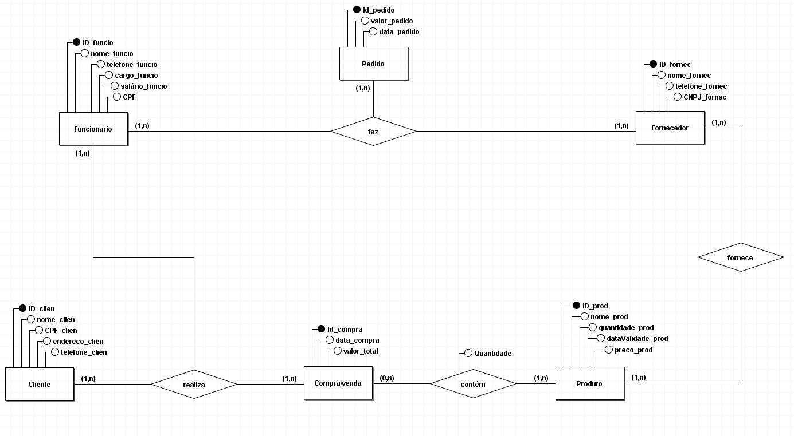

# Mercadinho do Cuel

O seguinte projeto faz parte da avaliação final da disciplina de BDI (Banco de Dados I)

## Índice
- [Minimundo](#minimundo)
- [Tecnologias utilizadas](#tecnologias-utilizadas)
- [Desenvolvimento](#desenvolvimento)
- [Modelo Entidade Relacionamento (MER)](#modelo-entidade-relacionamento)
- [Modelo Relacional (MR)](#modelo-relacional)
- [Consultas](#consulta)
- [Equipe](#equipe)

---

## Minimundo
No mercado do Cuel, uma rotina organizada é fundamental para garantir que produtos variados estejam sempre disponíveis e frescos para os clientes. O estoque é controlado com atenção, monitorando cada produto com informações detalhadas como ID, nome, preço, quantidade disponível e data de validade. Os fornecedores são essenciais para o abastecimento constante de itens necessários para reposição, com quem o mercado mantém uma relação regular para garantir a entrega pontual dos produtos, destes, é necessário ID, nome, telefone e CNPJ. Dos pedidos, é necessário o ID, valor e data. Os funcionários, incluindo atendentes e gerentes, cuidam das operações diárias, auxiliando no atendimento ao cliente e organizando o ambiente de compras e fazendo pedido aos fornecedores. Dos funcionários há a necessidade de armazenar ID, nome, cargo, telefone e salário. Dos clientes, o banco armazena o ID, nome, CPF, endereço e telefone. Todas as vendas realizadas são registradas, detalhando os produtos adquiridos, as quantidades e o valor total da compra.

## Tecnologias utilizadas
- brModelo para modelagem
- MySQL como SGBD

## Desenvolvimento
A equipe separou as atividades a serem feitas de maneira dinâmica, com separação de tasks onde decidiram juntos em cada parte cada um ia trabalhar, mas mantendo comunicação uns com os outros em relação a dificuldades com a própria parte.

## Modelo Entidade Relacionamento (MER)

## Modelo Relacional (MR)

## Consultas

## Equipe
<table align="center">
  <tr align="center">
  <td>
      <a href="https://github.com/Caiqueferlima">
        
        
Caíque  Fernandes

      </a>
    </td>
    <td>
      <a href="https://github.com/emillyjullyane">
        
        
Emilly  Jullyane

      </a>
    </td>
    <td>
      <a href="https://github.com/Guilhermeleandro-N">
        
        
Guilherme  Leandro

      </a>
    <td>
      <a href="https://github.com/mcclara18">
        
        
Maria  Clara

      </a>
    </td>
    <td>
      <a href="https://github.com/Rachelee18">
        
        
Raquel  Medeiros

      </a>
  </tr>
